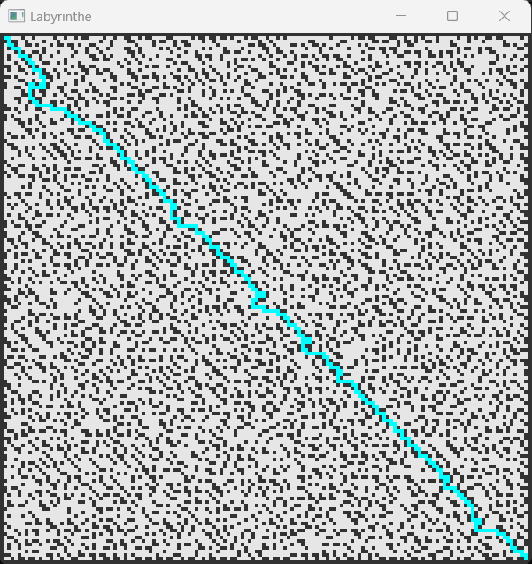

# Maze Solver in C++ (2021)


This is a simple 2D Maze Generator and Solver. The project is made from scratch, and use self-made algorithms to generate and solve the mazes. SFML is used for the graphics features.

## Features

- **Maze Generation and Solver :**
  The code generates a 2D maze and solve it. You can modify the size of the maze in the main file.

## Project Structure

- **/src :**
  - `Case.cpp`: Implementation of the Case class.
  - `Generate.cpp`: Implementation of the maze generator.
  - `Solver.cpp`: Implementation of the maze solver.
  - `Labyrinthe.cpp`: Main file handling window creation and event loops.

- **/include :**
  - `Case.h`: Header file for the Case class.
  - `Generate.h`: Header file for the generator.
  - `Solver.h`: Header file for the solver.

- **Raycasting.sln, Raycasting.vcxproj, Raycasting.vcxproj.filters, Raycasting.vcxproj.user :**
  Visual Studio project files.

- **CMakeLists.txt :**
  CMake configuration file for building the project with SFML 2.6.0.

- **README.md :**
  This file, containing project information, instructions, and usage details.

- **.gitignore :**
  Specifies files and directories to be ignored by Git, including build artifacts.

## Building the Project

To build the project, use CMake and follow these steps :

1. **Clone the Repository :**

```bash
git clone https://github.com/Atafid/Maze-Solver.git
```

2. **Navigate to the Project Directory :**

```bash
cd Maze-Solver
```

3. **Create a Build Directory :**

```bash
mkdir build
cd build
```

4. **Run CMake :**

```bash
cmake ..
```

5. **Build the Project :**

```bash
cmake --build .
```

6. **Copy dlls :**

```bash
cp _deps/sfml-build/lib/sfml-window-d-2.dll Debug/
cp _deps/sfml-build/lib/sfml-graphics-d-2.dll Debug/
cp _deps/sfml-build/lib/sfml-system-d-2.dll Debug/
```

7. **Run the Executable :**

```bash
./Debug/Maze-Solver
```

## Screenshots

<p align="center">
	
</p>


## Credits

- Project developed by Guillaume DI FATTA